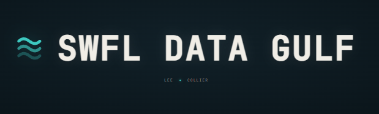

<p align="center">
  
</p>

<p align="center">
  <strong>Analyst-grade Southwest Florida data, delivered straight into your AI.</strong><br/>
  Live at <a href="https://www.swfldatagulf.com">swfldatagulf.com</a> · MCP endpoint at <code>/api/mcp</code>
</p>

---

## What it is

SWFL Data Gulf is a multi-brain intelligence platform for Lee and Collier counties. Dozens of live data pipelines feed into a DAG of "brains" — each brain owns one slice of reality and emits a single distilled output block. A master synthesizer reads the whole lake and produces one grounded, falsifiable direction call. Every number is cited, every source linked, confidence decays honestly with staleness.

The data is served over [Model Context Protocol (MCP)](https://modelcontextprotocol.io), so any MCP-compatible AI (Claude, Cursor, etc.) can query it directly — no copy-paste, no stale PDFs.

---

## Install the MCP server

```bash
# Claude Code
claude mcp add --transport http swfl https://www.swfldatagulf.com/api/mcp

# Claude Desktop / any MCP client
# Add to your mcp config:
# { "swfl": { "type": "http", "url": "https://www.swfldatagulf.com/api/mcp" } }
```

Then ask: _"What's the flood-adjusted investment picture for ZIP 33931?"_ and it fetches live data.

---

## What's live

| Brain                  | What it covers                                                |
| ---------------------- | ------------------------------------------------------------- |
| `master`               | Synthesizer — one grounded direction call over the whole lake |
| `macro-swfl`           | FRED rates, BLS unemployment (LAUS), labor participation      |
| `housing-swfl`         | Median sale prices, DOM, YoY deltas (LEEPA)                   |
| `env-swfl`             | FEMA flood zones, NFIP AAL, storm surge exposure              |
| `cre-swfl`             | Commercial corridor pulse — 25 verified corridors             |
| `sector-credit-swfl`   | SBA franchise outcomes, NAICS charge-off rates                |
| `labor-demand-swfl`    | BLS OEWS occupational demand + wages                          |
| `properties-lee-value` | Parcel-level Lee County values, SOH gap analysis              |
| `traffic-swfl`         | FDOT annual average daily traffic by road segment             |
| `tourism-tdt`          | Tourist Development Tax receipts                              |
| `notices-swfl`         | DBPR public business notices                                  |

---

## Architecture

```
Sources (FRED, BLS, FEMA, LEEPA, FDOT, SBA…)
    ↓  Python ingest pipelines
data_lake.*  (Supabase Postgres + Parquet on Storage)
    ↓  Refinery (Bun + TypeScript)
Brains  →  master synthesizer
    ↓  MCP / REST
Your AI
```

Three tiers:

- **Tier 1 — Reporters:** leaf brains, cited facts only, no opinions
- **Tier 2 — Synthesizer:** master, the only tier that speculates; conditional IF/THEN calls with a falsifier
- **Tier 3 — Conversation:** the user's AI reasons over master's dossier without re-fetching

---

## The carry contract

The payoff of the three-tier design lands in Tier 3. The master returns a **condensed dossier**, not an essay — and clipped to it is a **lean rules-of-engagement block** (~206 tokens, hard-capped at 210) that rides in every payload: `_meta.rules` over MCP, `?format=json` on `/api/b`. The downstream AI reasons over that bundle to answer follow-ups **without re-fetching** — the conversation stays grounded on a single pull instead of round-tripping the lake on every turn.

Because the rules travel _with_ the data, the model is bound by them at answer time, not just at fetch time:

- **Cite or don't claim** — no source in the payload, no assertion.
- **Mark inference** — anything past the cited facts is tagged `[INFERENCE]` with a base value and a falsifier.
- **Answer at the grain held** — a gap is an offer to pull, never an invented number.

One constant defines it — `refinery/lib/rules-of-engagement.mts` — imported by both the MCP server and the JSON route and mirrored to `THE-CONTRACT.md`, with a CI drift test keeping the copies in lockstep.

**Where this is heading.** Grounding keeps a single answer honest; memory is how the system carries judgment across answers. Today a personal vault banks strategic insights, recallable by term and tag. Next it grows into durable working memory — past deals, the issues they surfaced, and how they resolved — so the assistant builds consistent working habits and recognizes when a new situation rhymes with an old one.

---

## Design principles

A few invariants hold across every brain:

- **No LLM in the math path.** All scoring, normalization, and direction logic is deterministic TypeScript. The model is never asked to do arithmetic — it only writes narrative on top of numbers that are already locked.
- **Synthesis is gated, not assumed.** Brains that are pure deterministic rollups skip the synthesis-agent call entirely (`skipSynthesisAgent`). The expensive model runs only where it earns its cost.
- **Typed, acyclic DAG.** Edges between brains carry a type (`veto` vs `modifier`), and leaf brains never point back to master. The graph is acyclic by construction.
- **Every claim is falsifiable.** The master never emits an unconditional opinion. Direction calls ship as IF/THEN with an explicit falsifier — the condition under which the call is wrong.
- **Citations branch on the real source.** A citation reflects where the number actually came from (live table vs fixture), never a hardcoded path. No phantom data.
- **No magic numbers.** Any constant that touches scoring, thresholds, or normalization carries an inline source or a `SOURCED.md` entry. "Feels right" is not a citation.
- **Fail open to rebuild.** Content-hashing and caching are cost levers only, never safety gates. When in doubt the system rebuilds rather than serves stale.
- **Confidence decays with staleness; thin samples are suppressed.** Below a sample-size floor a brain refuses to make a call rather than fabricate one.

---

## Correctness & CI

The DAG is policed automatically, not by hand:

- **`facts-only-lint`** — leaf brains may state cited facts only; synthesized or inferred claims are confined to the master tier and must carry an `[INFERENCE]` tag plus a falsifier.
- **`spec-validator`** — every brain output block is validated against a versioned schema before it can ship.
- **Daily freshness probes** — every source is checked for staleness and confidence is decayed automatically as data ages.
- **GitHub Actions** — ingest, rebuild, and freshness run on cron, and every push is gated through a rebase-safe push guard.

---

## Tech stack

| Layer              | Tool                                 |
| ------------------ | ------------------------------------ |
| Frontend / API     | Next.js 16 (App Router) + TypeScript |
| Database           | Supabase (Postgres + Storage)        |
| Refinery / tooling | Bun + TypeScript                     |
| Ingest pipelines   | Python + dlt                         |
| Analytics          | DuckDB                               |
| Deployment         | Vercel                               |

---

## Data coverage

Lee County + Collier County, Florida. Grain: county → corridor → ZIP. Named towns and beaches (Fort Myers Beach, Bonita Springs, Naples, Cape Coral, Estero, Marco Island, etc.) resolve to their ZIP.

---

## Repo layout

```text
app/                  Next.js App Router — pages, REST + MCP API
components/            React UI components
lib/                  Shared TypeScript helpers
utils/                Supabase client + server helpers
types/                Shared TypeScript types
public/               Static assets (logo, icons)
refinery/             Brain factory: packs, stages, validators, vocab
ingest/               Python dlt ingest pipelines, one per source
brains/               Compiled brain outputs, one .md per brain
fixtures/             JSON fixtures for deterministic tests
tools/                Lake MCP server
scripts/              Operational scripts (safe-push, ledger checks)
docs/                 Standards, blueprints, plans, specs
_diagrams/            Architecture + flow diagrams (Mermaid)
_AUDIT_AND_ROADMAP/   Build queue, roadmap, audit snapshots
.github/              CI: cron ingest, rebuild, freshness probes
.claude/              Agent hooks + shared settings
```

---

## Contact

`support@swfldatagulf.com`
