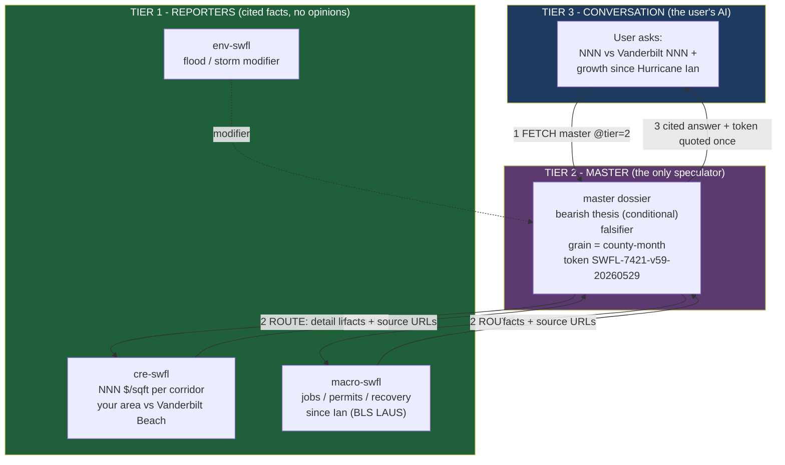
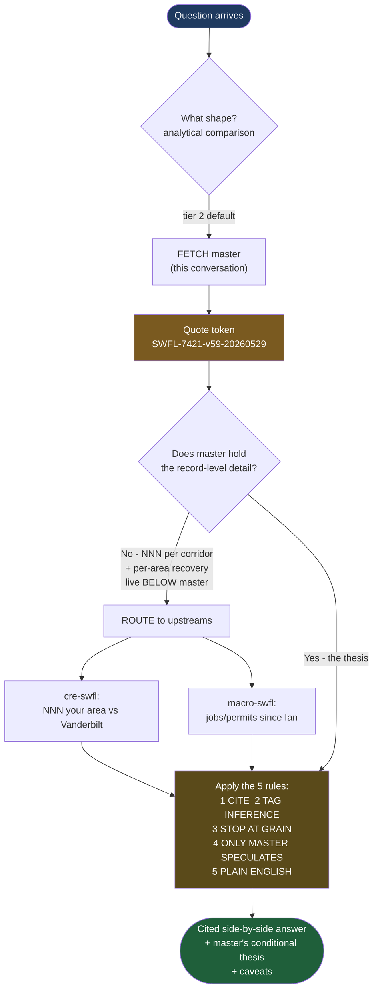
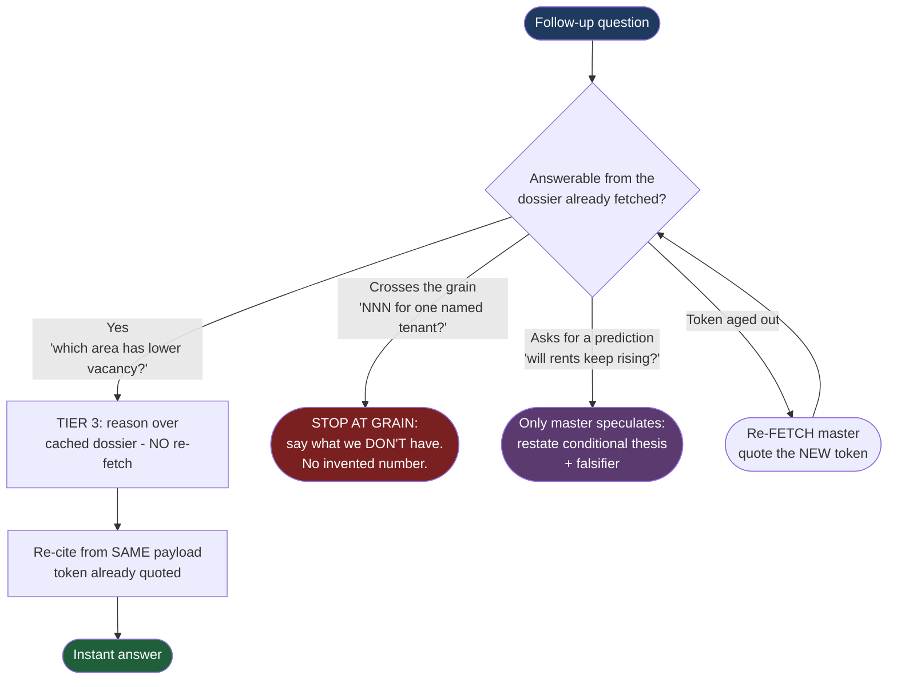

# SWFL Data Gulf — Contract Flow

How a user gets answers to: _"How is NNN compared to Vanderbilt NNN, and tell me about each area's economic growth since Hurricane Ian?"_ — and how the contract holds on the follow-up.

Live token at capture: `SWFL-7421-v59-20260529` (master read: bearish).

---

## Picture 1 — The three-tier building (where the data lives)

---

## Picture 2 — Step-by-step flow for the first question

---

## Picture 3 — The follow-up (Tier 3 stands on the payload it already has)

